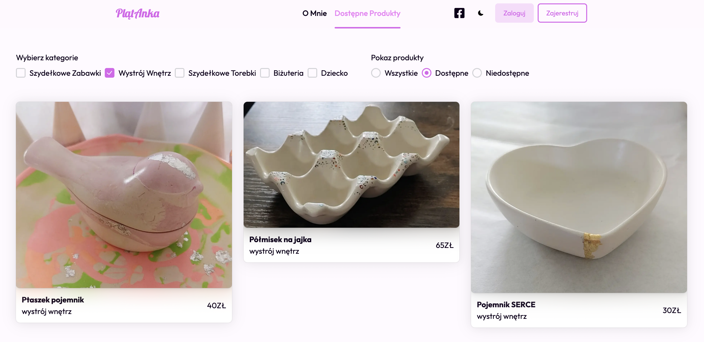

 

Strona internetowa **PlatAnka**, jest serwisem dającą możliwość prezentacji i sprzedaży przedmiotów. Platforma daje możliwość użytkownikom zainteresowania się opcją zamówienia m.in. dekoracji wnętrz, zabawek dla dzieci czy przedmiotów stworzonych przy użyciu
techniki szydełkowania.

## Projekt podzielony jest na trzy główne części:

- Front-End (**Strona Internetowa**) - Odpowiedzialny za interfejs wizualny

- Back-End (**API**) - Odpowiedzialny za część logiczną

- Dev-Ops - Odpowiedzialny za izolacje projektem i skalowaniem aplikacji

 

## Frond-End (Strona Internetowa)

**Front-End**, który odpowiedzialny jest za strone internetową. Został stworzony w środowisku [Visual Studio Code](https://code.visualstudio.com/), z wykorzystaniem języka [Typescript](https://www.typescriptlang.org/), biblioteki [React](https://react.dev/) oraz framework'a [Next.js](https://nextjs.org/).

### Używane Biblioteki:

Najważniejszą biblioteką wykorzystywaną jest [React](https://react.dev/), jest mózgiem strony internetowej.
Jednym z ważnieszych aspektów strony internetowej jest część wizualna, która jest wspierana przez technologie [Tailwind](https://tailwindcss.com/) oraz [NextUI](https://nextui.org/). Oprócz części wizualnej serwisu, równie ważnym fragmentem też jest autoryzacja użytkownika od strony sesji na stronie czy ciasteczek cookie, która jest wspierana przez [NextAuth](https://next-auth.js.org/), jaka m.in. umożliwia logowanie / rejestrowanie się przez Google. Przy tworzeniu formularzy używam hook'a *useForm* z *react-hook-form* a za schematem walidacji pól stoi [YUP](https://github.com/jquense/yup).

 

## Back-End (API)

**Back-End** obejmuje Restful API, odpowiedzialne za logikę strony internetowej. Zostało stworzone w środowisku [Visual Studio](https://visualstudio.microsoft.com/pl/), przy użyciu języka
[C#](https://learn.microsoft.com/pl-pl/dotnet/csharp/) oraz z użyciem framework'a [ASP .NET CORE](https://learn.microsoft.com/pl-pl/aspnet/core/introduction-to-aspnet-core).
Najważniejszą częścią strony internetowej od strony logicznej jest właśnie Back-End. Odpowiada za wszyskie działania związane z zarządzaniem danymi.

### Używana Biblioteka

W celu weryfikacji użytkownika program wykorzystywuje [MailKit](https://github.com/jstedfast/MailKit), który umożliwia wysłania wiadomości na email.

### Baza Danych

Serwis PlatAnka wykorzystuje baze danych NoSQL [MongoDB](https://www.mongodb.com/).

 

## Dev-Ops

**Dev-Ops** wykorzystuje serwis PlatAnka w zakresie programu [Docker](https://www.docker.com/), który umożliwia przechowywanie i uruchamianie wszystkich instancji aplikacji WEB, API oraz bazy danych za pomocą narzędzia docker-compose. To zapewnia efektywną izolację środowiska i umożliwia łatwe skalowanie aplikacji.

## Serwis PlatAnka

Strona posiada możliwość, która pozwala na zmianę motywu na ciemny lub jasny.

Istnieje możliwość sortowania produktów na podstawie ich kategorii i dostępności.

### Strona Logowania

Logowanie na serwis jest możliwe za pomocą hasła i emaila lub poprzez dostawce Google.

Jeśli zapomniałeś hasło możesz kliknąć w **'Zapomniałeś Hasło?'**.
Które przenosi na strone *Reset*, gdzie po kliknięciu przycisk **'Wyślij'**. Wyśle na podany adres email kod 4 cyfrowy, który musisz podać na stronie *Potwierdź*, by potwierdzić email.

### Strona Reset

### Strona Potwierdź

### Strona Rejestracji

Rejestracja jest możliwa za pomocą emaila i hasła lub przez dostawce Google.

Oczywiście we wszystkich polach jest używana walidacja.

Po wpisaniu prawidłowych danych, bedziesz musiał potwierdzić adres email, na który został wysłany kod 4 cyfrowy.

 
 

## ! Projekt jest nadal rozwijany !

 

### Projekt Stworzony przez

## [Jakub Kruliczak](https://github.com/MstrJ)
